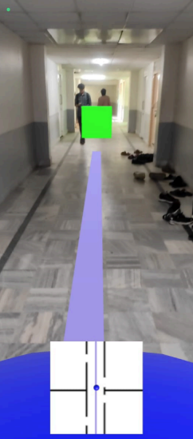
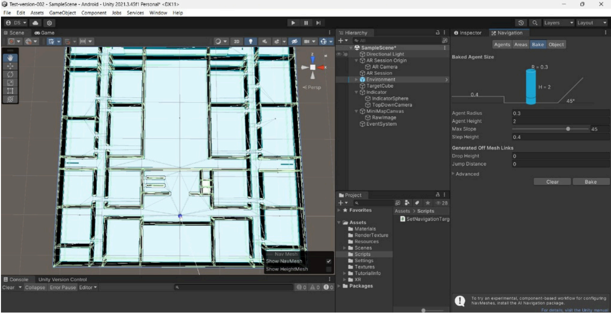
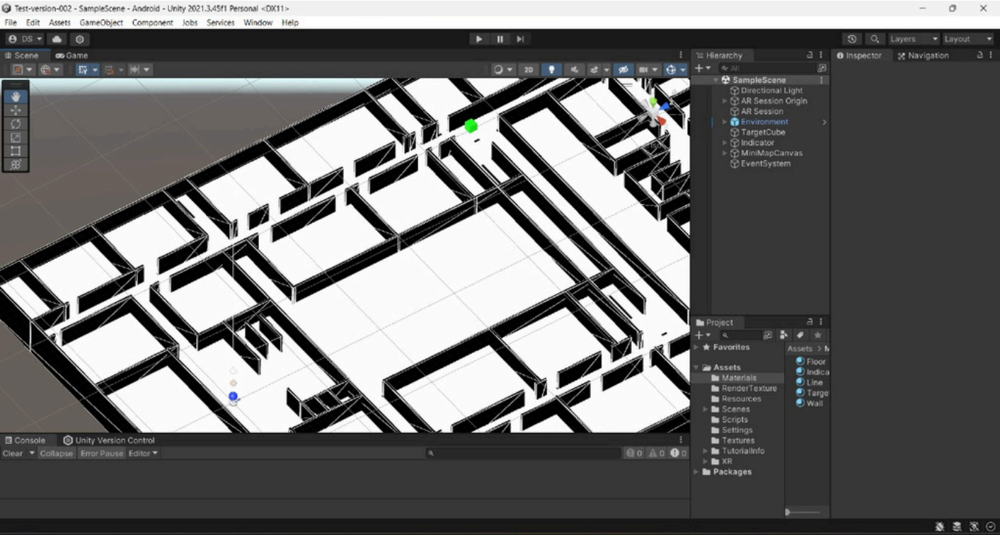

# 🗺️ AR Indoor Navigation

An Augmented Reality indoor navigation system built with Unity and AR Foundation for real-time wayfinding in complex indoor environments.

## 📱 Overview

This project uses AR technology to guide users through indoor spaces by overlaying directional arrows and path markers on the real-world view through their mobile device camera.

## ✨ Features

- Real-time AR path visualization
- Touch-based target selection
- Dynamic route calculation
- Interactive waypoint markers
- Cross-platform support (Android/iOS)

## 🛠️ Tech Stack

- **Engine**: Unity 2022.x
- **AR Framework**: AR Foundation / ARCore
- **Language**: C#
- **Platform**: Android (APK included)

## 📸 Screenshots

### Main Navigation View


### AR Path Overlay


### Target Selection


## 🚀 Getting Started

### Prerequisites
- Unity 2022.3 or higher
- Android SDK (for Android builds)
- AR-capable device

### Installation

1. Clone the repository:
```bash
git clone https://github.com/benny10ben/AR-Indoor-Navigation.git
cd AR-Indoor-Navigation
```

2. Open the project in Unity Hub

3. Open the main scene: `Assets/Scenes/MainScene.unity`

4. Build and run on your AR-capable device

## 📱 APK Installation

Download the pre-built APK from the releases and install on your Android device. Ensure "Install from Unknown Sources" is enabled.

## 📂 Project Structure

```
Assets/
├── Scenes/          # Unity scenes
├── Scripts/         # C# scripts
├── Materials/       # Materials and textures
├── Prefabs/         # Reusable game objects
└── XR/              # AR configuration
```
